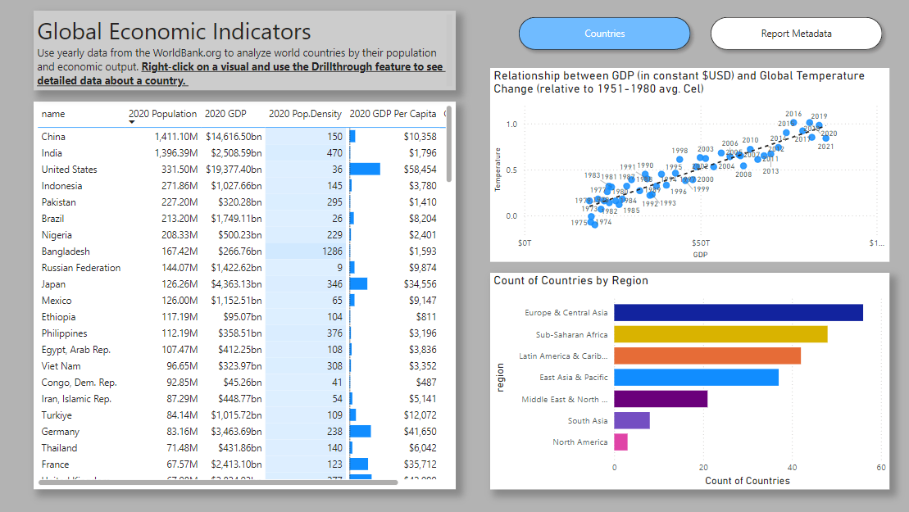
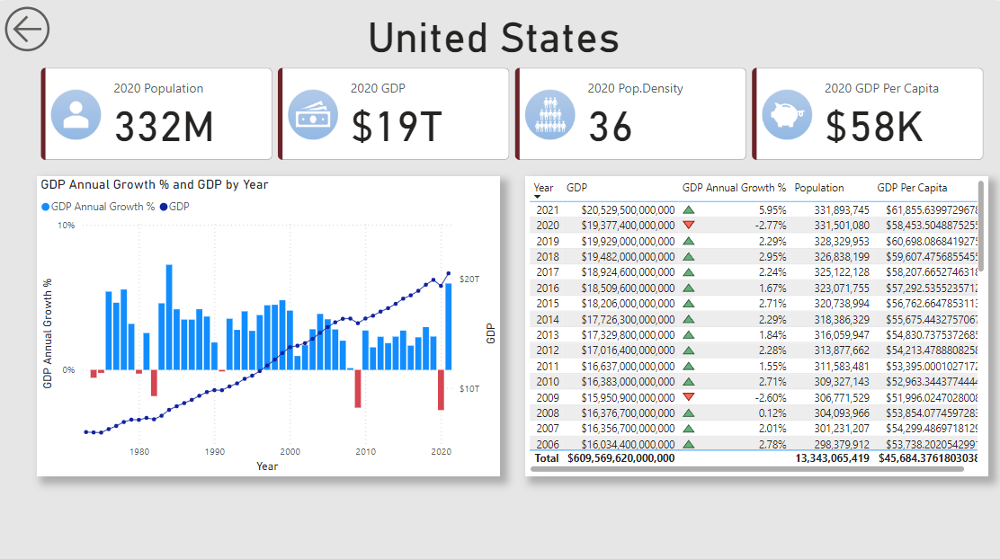

# Power BI Dashboard: Global Countries Overview  

## Summary  
An interactive dashboard analyzing global countries' 2020 population, GDP, population density, and economic trends. Features include sparklines, scatterplots, regional insights, and drill-through functionality for detailed country analysis.  

## Visualizations  

### Countries Overview  
  

### Drillthrough Details  
  

## Features

### Countries Overview Page:
- **Table**: Displays country data for 2020, including population, GDP, population density, and a sparkline showing GDP trends.  
- **Scatterplot**: Plots GDP on the X-axis, Temperature on the Y-axis, with values representing years.  
- **Regional Count**: Shows the total number of countries by region.

### Drillthrough Page:
- **Country-Specific Data**:  
  - 2020 population, GDP, and population density.  
  - Line and stacked column chart showing GDP growth percentage and GDP over the years.  
  - Table with GDP growth percentage, GDP per capita, and trend indicators (up/down).

### Metadata Page:
- Lists the API sources used in the dashboard.  
- Includes a metadata matrix detailing dataset attributes.

### Navigation:  
- Buttons to switch between the Overview and Metadata pages.  

## Drillthrough  
Explore detailed data for any selected country, including GDP growth trends and economic performance over time.  

## Metadata  
- **Sources**: APIs for population, GDP, and climate data.  
- **Matrix**: Summary of dataset attributes (fields, types, sources).  

